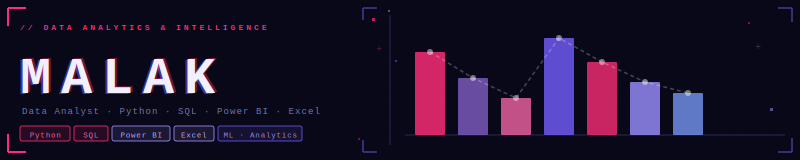

 

 

&nbsp;&nbsp;
&nbsp;&nbsp;
&nbsp;&nbsp;

---

## `> about`

- 🎓 Data Science @ Canadian International College (CIC) — GPA **3.72**
- 📊 Specializing in Data Analytics · pursuing **Microsoft PL-300** (Power BI) certification
- 🐍 Building with Python, SQL, Power BI, and Excel on real-world datasets
- 💼 Freelancing on Khamsat, Upwork & Ureed — dashboards, data cleaning, reporting
- 🌱 DEPI graduation project: ETL pipeline with SQL Server + Steam Games star schema & Power BI dashboards
- 🔍 Open to internships, research, and open source contributions

---

## `> stack`

---

## `> stats`

&nbsp;

---

`// thanks for stopping by · have a good one`

